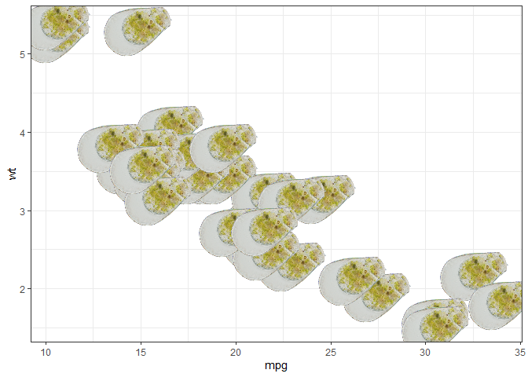

<!-- README.md is generated from README.Rmd. Please edit that file -->

# ggprotist

<!-- badges: start -->

[](https://www.tidyverse.org/lifecycle/#maturing)
<!-- badges: end -->

The goal of ggprotist is to provide nice pictures of protists to plot on
your ggplot graphs

## Installation

ggprotist ca be installed with:

``` r
# install.packages("devtools")
devtools::install_github("nibortolum/ggprotist")
```

## Example

### Hyalosphenia Papilio

``` r
library(ggplot2)
library(ggprotist)

ggplot(mtcars) +
 geom_TA(aes(mpg, wt), TA = "papilio") +
 theme_bw()
```


